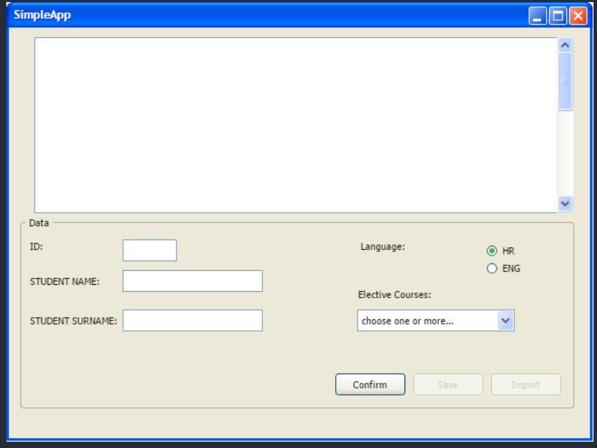

## Ispitni rok 18.06.2021.
### Zadatak 1 - GUI

Potrebno je napraviti GUI prema slici 1 na način da kreirate klasu `Student` u koju ćete moći bilježiti sve podatke sa zadane forme. Važno je da osigurate višestruki odabir kod izbornih predmeta. Izborni predmeti neka budu **IZBORNI_1** do **IZBORNI_8** redom, a polje id se automatski generira.

**Slika 1** Izgled GUI-a uz prvi zadatak

Podaci o studentu se klikom na dugme `Confirm` prikazuju u prezentacijskom panelu. Isto tako, kada se unesu podaci za prvog studenta aktivira se dugme `Save` koje omogućuje spremanje podataka o studentima u pripadnu strukturu podataka koja se pak sprema u `.bin` datoteku `studenti.bin`. Po spremanju podataka aktivira se dugme `Import` koje omogućuje uvoz spremljanih podataka i njihov pregled u prezentacijskom panelu.

> **NAPOMENA:** Rješenje treba imati MainFrame, FormPanel i ViewPanel. 
