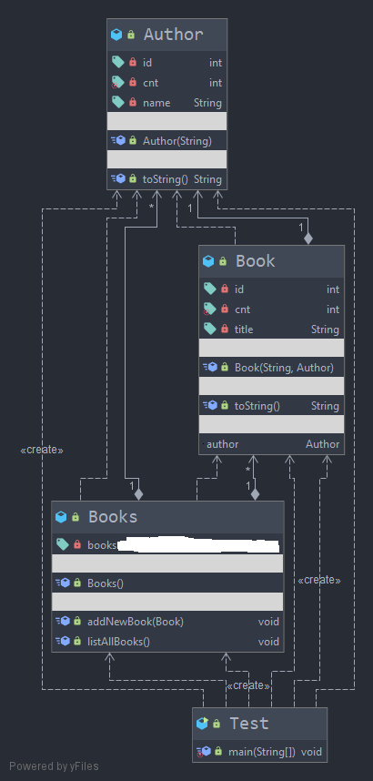

## Ispitni rok 18.06.2021.
### Zadatak 3

kreirati klase prema dijagramu klasa:

Zbog jednostavnosti ćemo pretpostaviti da svaka knjiga ima jednog autora. S druge strane, svaki autor može imati više knjiga. Kako možete vidjeti, u dijagramu klasa je tip atributa books istoimene klase skriven jer je važno da iz konteksta zadatka odredite pogodnu strukturu podataka. U glavnom dijelu programa napravite tri autora, gdje svaki autor ima tri knjige. Izlistajte sve knjige po autorima.

Konzolni izlaz za primjer je:

    Books of the author - Author{id=100, name='AUTHOR-1'}
    Book{id=100, title='Book-1', author=Author{id=100, name='AUTHOR-1'}}
    Book{id=101, title='Book-2', author=Author{id=100, name='AUTHOR-1'}}
    
    Books of the author - Author{id=101, name='AUTHOR-2'}
    Book{id=102, title='Book-3', author=Author{id=101, name='AUTHOR-2'}}
    Book{id=103, title='Book-4', author=Author{id=101, name='AUTHOR-2'}}
    Book{id=104, title='Book-5', author=Author{id=101, name='AUTHOR-2'}}

