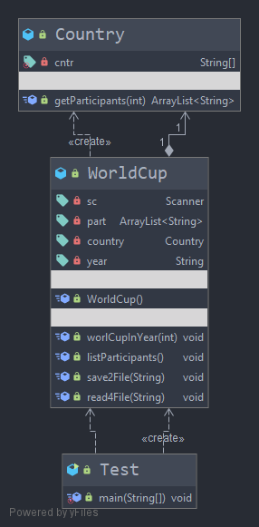

## Ispitni rok 18.06.2021.
### Zadatak 4
Kreirati klase po dijagramu klsa:

U klasi Contry zadane su vam države koje mogu biti sudionici svjetskog natjecanja:

private static String[] cntr = { "France", "Spain", "USA", "Croatia", "Deutschland", "Belgium", "Sweeden", "Canada",
"Great Britain", "Russia", "Kongo", "Mexico", "Brasil", "Turkey", "S. Korea", "N. Korea", "Japan", "BiH",
"Slovenia", "Chile", "Maroco", "New Zealand", "Australia", "Island", "Argentina", "Tunis" };

Klasa Country ima metodu koja vraća listu sudionika koja se generira slučajno iz prethodnog niza za željeni broj sudionika num koji se definira pri pozivu te metode. Za slučaj da je taj broj jednak ili veći broju država u navedenom nizu vraća se lista sa svim državama. Klasa WorldCup ima metodu worldCupInYear koja od korisnika traži unos godine svjetskog prvenstva (ne traži se provjera korisničkog unosa) i za tu godinu generira listu sudionika slučajnim odabirom opisanim ranije. Nadalje imamo zadano sljedeće specifikacije:
    
1. save2File → metoda koja sprema listu sudionika i godinu u .txt datoteku na način da se novi podaci uvijek nadodaju prijašnjim
2. read4File → čita sve podatke iz .txt datoteke i ispisuje ih u konzolu

Testiranje provedite na sljedeći način:

    1. Kreirajte i ispišite listu sudionika (5) za npr. 1982. godinu
    2. Spremite te podatke u datoteku worldCup.txt
    3. Kreirajte i ispišite listu sudionika (4) za npr. 1990. godinu
    4. Spremite te podatke u datoteku worldCup.txt
    5. Kreirajte i ispišite listu sudionika (3) za 2010. godinu
    6. Spremite te podatke u datoteku worldCup.txt
    7. Pročitajte i prikažite u konzoli podatke iz datoteke worldCup.txt
