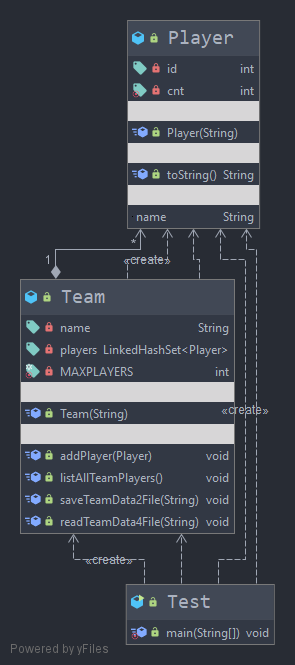

## Ispitni rok 18.06.2021.
### Zadatak 5

Kreirati klase po dijagramu klsa:

Pretpostavit ćemo da svaki tim može imati samo MAXPLAYERS igrača. To znači da dodavanje igrača nije moguće ukoliko ih u timu već ima taj broj → popratna poruka je obavezna (vidjeti konzolni izlaz primjera). Ključni dio ovog zadatka su metode saveTeamData2File i readData4File. Prva sprema podatke u .bin datoteku, a druga čita podatke iz .bin datoteke. Testiranje provedite na sljedeći način:
    
    1. Kreirajte jedan tim s MAXPLAYERS = 3
    2. Kreirajte četiri igrača
    3. Dodajte prvog, drugog, pa opet drugog igrača u tim
    4. Dodajte treećeg i četvrtog igrača u tim
    5. Spremite podatke o timu u bin datoteku teamData.bin
    6. Pročitajte podatke iz datoteke teamData.bin

---
Metoda za čitanje podataka iz bin datoteke treba izlistati sve pročitane podatke → listAllTeamPlayers

---

konzolni izlaz primjera:

    Player added to the team - BEST - TEAM
    Player added to the team - BEST - TEAM
    The player PLAYER-02 already is in this team!
    Player added to the team - BEST - TEAM
    Unable to add a new player - max number of players is in the team...
    
    The team data written in the file: teamData.bin
    
    Success - reading from file was ok!
    All data from the file - teamData.bin
    Player{id=1, name='PLAYER-01'}
    Player{id=2, name='PLAYER-02'}
    Player{id=3, name='PLAYER-03'}